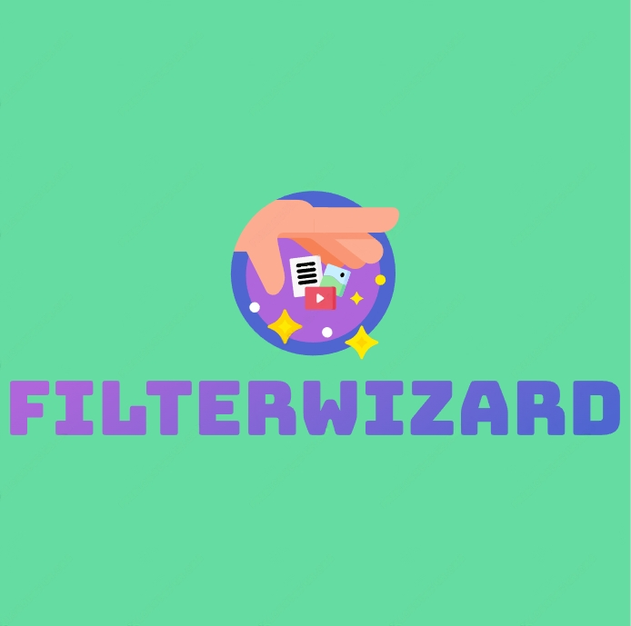

<p align="center">
  
</p>
<h1 align="center">
  <b>FilterWizard Bot</b>
</h1>


[](https://github.com/kaizensoftware/FilterWizard/stargazers)
[](https://github.com/kaizensoftware/FilterWizard/fork)
[](https://github.com/kaizensoftware/FilterWizard/)   
[](https://github.com/kaizensoftware/FilterWizard)   
[](https://github.com/kaizensoftware/FilterWizard/graphs/contributors)
[](https://github.com/kaizensoftware/FilterWizard/blob/main/LICENSE)


## Features

- [x] Auto and Manual Filter
- [x] Restrict Group(s) Feature
- [ ] Control your chats, users in database easily! (with sqlite3)
- [x] IMDB and Inline search
- [x] Broadcast Feature
- [x] IDs and User info 
- [x] Stats, Users, Chats, Ban, Unban, Leave, Disable chats and channels
- [x] Spelling Check Feature

## Variables

Read [this](https://telegram.dog/birmuhendisinkanallari) before you start messing up with your edits.

### Required Variables
* `BOT_TOKEN`: Create a bot using [@BotFather](https://telegram.dog/BotFather), and get the Telegram API token.
* `API_ID`: Get this value from [telegram.org](https://my.telegram.org/apps)
* `API_HASH`: Get this value from [telegram.org](https://my.telegram.org/apps)
* `CHANNELS`: Username or ID of channel or group. Separate multiple IDs by space
* `ADMINS`: Username or ID of Admin. Separate multiple Admins by space
* `DATABASE_URI`: [mongoDB](https://www.mongodb.com) URI. Get this value from [mongoDB](https://www.mongodb.com). For more help watch this [video](https://youtu.be/1G1XwEOnxxo)
* `DATABASE_NAME`: Name of the database in [mongoDB](https://www.mongodb.com). For more help watch this [video](https://youtu.be/Miajl2amrKo)
* `LOG_CHANNEL` : A channel to log the activities of bot. Make sure bot is an admin in the channel.
### Optional Variables
* `PICS`: Telegraph links of images to show in start message.( Multiple images can be used separated by space )
* `FILE_STORE_CHANNEL`: Channel from were file store links of posts should be made.Separate multiple IDs by space
* Check [info.py](https://github.com/kaizensoftware/FilterWizard/blob/master/info.py) for more


## Deploy
You can deploy this bot anywhere.

[](https://dashboard.scalingo.com/create/app?source=https://github.com/kaizensoftware/FilterWizard)


<i>**[Watch Deploying Tutorial...](https://youtu.be/Miajl2amrKo)**</i>

<details><summary>Deploy To Heroku</summary>
<p>
<br>
<a href="https://telegram.dog/XTZ_HerokuBot?start=QU0tUk9CT1RTL0V2YU1hcmlhIG1haW4">
  
</a>
</p>
</details>

<details><summary>Deploy To VPS</summary>
<p>
<pre>
git clone https://github.com/kaizensoftware/FilterWizard
# Install Packages
pip3 install -U -r requirements.txt
Edit info.py with variables as given below then run bot
python3 bot.py
</pre>
</p>
</details>


## Commands
```
• /logs - to get the rescent errors
• /stats - to get status of files in db.
* /filter - add manual filters
* /filters - view filters
* /connect - connect to PM.
* /disconnect - disconnect from PM
* /del - delete a filter
* /delall - delete all filters
* /deleteall - delete all index(autofilter)
* /delete - delete a specific file from index.
* /info - get user info
* /id - get tg ids.
* /imdb - fetch info from imdb.
• /users - to get list of my users and ids.
• /chats - to get list of the my chats and ids 
• /index  - to add files from a channel
• /leave  - to leave from a chat.
• /disable  -  do disable a chat.
* /enable - re-enable chat.
• /ban  - to ban a user.
• /unban  - to unban a user.
• /channel - to get list of total connected channels
• /broadcast - to broadcast a message to all FilterWizard users
```
## Support
[](https://telegram.dog/bmkdestekhattibot)
[](https://telegram.dog/birmuhendisinkanallari)

## Credits 
[](https://telegram.dog/cinarmecnun)


## Thanks to 
 - Thanks To Dan For His Awesome [Library](https://github.com/pyrogram/pyrogram)
 - Thanks To Mahesh For His Ritesh [Evamaria](https://github.com/ritheshrkrm)
 - Thanks To [Trojanz](https://github.com/trojanzhex) for Their Awesome [Unlimited Filter Bot](https://github.com/TroJanzHEX/Unlimited-Filter-Bot) And [AutoFilterBoT](https://github.com/trojanzhex/auto-filter-bot)
 - Thanks To All Everyone In This Journey

## Disclaimer
[](https://www.gnu.org/licenses/agpl-3.0.en.html#header)    
Licensed under [GNU AGPL 2.0.](https://github.com/kaizensoftware/FilterWizard/blob/master/LICENSE)
Selling The Codes To Other People For Money Is *Strictly prohibited*. Because it's an open source bot.
